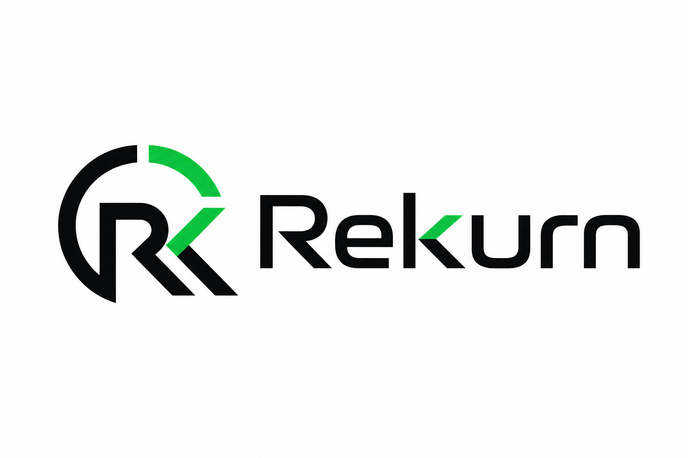

# Rekurn

Rekurn is a lightweight versioning and release system built for modern TypeScript projects, self-hosted infrastructure, and Vercel-style deployments. It works like Git in spirit, with familiar local commands for commits, branches, pushes, pulls, merges, snapshots, verification, and deployment hooks, while keeping the system small enough to adapt to your own applications.



Rekurn was built for oreulius.com so our own sites can have an independent repository, retrieval, and release workflow. The public goal is broader: provide a clean CLI and SDK that can be bolted into existing hosted projects when Git or heavier versioning workflows are not the right fit.

## Install

Install the CLI globally:

```bash
npm install -g rekurn@0.2.0
```

Or run it directly:

```bash
npx rekurn@0.2.0 --help
```

Install the SDK:

```bash
npm install @reeveskeefe/rekurn-sdk@0.2.0
```

API reference:

https://oreulius.com/api-reference

## CLI

Initialize a repository:

```bash
rekurn init
rekurn add .
rekurn commit -m "initial commit"
```

Work with branches and history:

```bash
rekurn branch feature
rekurn return feature
rekurn log --oneline
rekurn timeline
```

Configure a remote and push securely:

```bash
rekurn login
rekurn remote set https://api.example.com/<username>/<repo-name>
rekurn push origin main
```

For signed push certificates, configure an Ed25519 secret key seed:

```bash
rekurn config signing-key ~/.rekurn/keys/push-ed25519
rekurn push origin main
```

Create immutable snapshots:

```bash
rekurn snapshot v1.0.0
rekurn return @v1.0.0 --preview
```

Merge branches:

```bash
rekurn merge feature
```

Verify repository integrity:

```bash
rekurn verify
```

Configure and trigger deployments:

```bash
rekurn config deploy-hook production https://example.com/deploy
rekurn deploy production @v1.0.0
rekurn rollback @v1.0.0
```

## SDK

```ts
import { RekurnClient } from '@reeveskeefe/rekurn-sdk'

const rekurn = new RekurnClient({
  baseUrl: 'https://api.rekurn.com',
  token: process.env.REKURN_TOKEN,
})

const repos = await rekurn.repos.list()
```

The SDK is ESM, dependency-free at runtime, tree-shakable, and includes TypeScript declarations. It enforces HTTPS by default, supports request timeouts, retries transient failures with backoff, and sanitizes API errors.

## Packages

- rekurn: the CLI package for global installs and npx.
- @reeveskeefe/rekurn-sdk: the TypeScript SDK for applications and integrations.

The monorepo also contains internal packages for core object handling, crypto, diffing, API routes, and database schema.


## Security

Rekurn uses content-addressed objects and verifies object hashes before storage. Sensitive operations such as object upload, ref updates, deploy hook updates, and deployment recording require write access. Public API routes are rate-limited, and SDK clients should keep tokens in environment variables or a platform secret store.

Push uses bearer-token authentication, HTTPS remote enforcement, compare-and-swap ref updates, object hash validation, and optional Ed25519 signed push certificates. Localhost HTTP remotes are only allowed when `REKURN_ALLOW_INSECURE_REMOTE=1` is set for development.

Do not commit API tokens, deploy hooks, private keys, signing keys, or production `.rekurn/config` files.

## Development and Contributing

Install dependencies:

```bash
pnpm install
```

Run type checks:

```bash
pnpm type-check
```

Run tests:

```bash
pnpm test
```

Build publishable packages before release or when changing CLI/SDK packaging:

pnpm --filter rekurn build
pnpm --filter @reeveskeefe/rekurn-sdk build


## License

Apache-2.0
